# 🎨 Database System Overview

## 🧱 1. Three-Tier Architecture

```mermaid
graph LR
  A[👨‍💻 Client (GUI/Web Interface)] --> B[🌐 Application/Web Server (App Programs/Web Pages)]
  B --> C[🗄️ Database Server (DBMS)]
```

---

## 🧩 2. View of Data (Abstraction Levels)

| Level        | Description                                | Complexity        |
|--------------|--------------------------------------------|-------------------|
| 🔧 **Physical** | How data is stored, uses complex structures | 🔽 Lowest          |
| 📊 **Logical**  | What data is stored and relationships      | ⚖️ Medium          |
| 👀 **View**     | User-level access and representation       | 🔼 Highest         |

---

## 🧬 3. Schemas

📌 A schema is like a **variable declaration** for your database — the **overall design**. It's stable and rarely changed.

### Types of Schemas:

- 🔹 **Sub-Schemas** — User-specific views
- 🔸 **Logical Schema** — Logical structure of entire database
- ⚙️ **Physical Schema** — Actual physical storage structure

---

## 👥 4. Types of Users

| User Type             | Role/Description                        |
|-----------------------|-----------------------------------------|
| 🙋 **Naive Users**        | End users (e.g. bank tellers)             |
| 💻 **Application Programmers** | Build and maintain application software |
| 🧠 **Sophisticated Users**   | Analysts, write complex queries         |
| 🛠️ **Specialized Users**     | DBAs and engineers managing systems     |

---

## 🧾 5. Data Models

- 📘 **Relational Model**
- 📙 **Entity-Relationship (ER) Model**
- 📗 **Object-Based Model**
- 📕 **Semi-Structured Model** (e.g., XML, JSON)

---

## 🏗️ 6. Database System Architecture

### 🧩 Full Architecture Diagram

```mermaid
flowchart TD
    subgraph Users
        A1[🙋 Naive Users\n(Tellers, Agents, Web Users)] --> A2[🖥️ App Interface]
        B1[💻 Application Programmers] --> B2[🧾 App Programs]
        C1[🧠 Sophisticated Users\n(Analysts)] --> C2[🔍 Query Tools]
        D1[🛠 Database Administrators] --> D2[⚙️ Admin Tools]
    end

    subgraph System_Components
        A2 --> SC1[📦 App Program Object Code]
        B2 --> SC1
        C2 --> SC3[💬 DML Queries]
        D2 --> SC4[🛠️ DDL Interpreter]
    end

    subgraph Query_Processor
        SC1 --> Q1[⚙️ Query Evaluation Engine]
        SC3 --> Q2[DML Compiler & Organizer]
        Q2 --> Q1
        Q1 --> Q3[📊 Statistical Data]
    end

    subgraph Storage_Manager
        Q1 --> SM1[🧮 Buffer Manager]
        Q1 --> SM2[📂 File Manager]
        Q1 --> SM3[🔄 Transaction Manager]
        Q1 --> SM4[🔐 Auth & Integrity Manager]
    end

    subgraph Disk_Storage
        SM1 --> DS1[(📑 Data)]
        SM2 --> DS2[(🗂️ Indices)]
        Q3 --> DS3[(📊 Statistical Data)]
        SM4 --> DS4[(📘 Data Dictionary)]
    end
```

---


### 👥 Users Interaction

```mermaid
flowchart TB
  Naive[🙋 Naive Users] -->|Use| UI[🖥️ Application Interface]
  Programmer[💻 App Programmers] -->|Write| Code[📦 Application Code]
  Analyst[🧠 Analysts] -->|Use| Tools[🔍 Query Tools]
  Admin[🛠️ Admins] -->|Use| AdminTools[🧰 Admin Tools]
```



### 🔧 System Components

```mermaid
graph TD
  AppCode[📦 App Program Object Code] --> Engine[⚙️ Query Eval Engine]
  Engine --> Manager[🗃️ Storage Manager]
  Manager --> Compiler[🛠️ DML Compiler & Organizer]
```



### 🧠 Query Processor

- **Query Eval Engine**
- **DML Compiler**
- **Stats Collector**

### 📦 Storage Manager

- 🧮 Buffer Manager  
- 📂 File Manager  
- 🔄 Transaction Manager  
- 🔐 Auth & Integrity Manager

### 💾 Disk Storage

- 📑 Data  
- 🗂️ Indices  
- 📊 Statistical Data  
- 📘 Data Dictionary (Metadata)

---

## 🧱 7. Data Definition Language (DDL)

```sql
CREATE TABLE table_name(col1 datatype, col2 datatype, ...);
ALTER TABLE table_name ADD column_name datatype;
TRUNCATE TABLE table_name;
DROP TABLE table_name;
RENAME TABLE old_table TO new_table;
```

---

## ✍️ 8. Data Manipulation Language (DML)

```sql
INSERT INTO table_name(col1, col2) VALUES (val1, val2);
UPDATE table_name SET col1 = val1 WHERE condition;
DELETE FROM table_name WHERE condition;
SELECT col1, col2 FROM table_name WHERE condition;
```

---

## 🛡️ 9. Data Control Language (DCL)

```sql
GRANT SELECT ON Student TO Ratul;
REVOKE SELECT ON Student FROM Ratul;
```

---

## 🔄 10. Transaction Control Language (TCL)

```sql
COMMIT;
SAVEPOINT my_savepoint;
ROLLBACK TO my_savepoint;
SET TRANSACTION READ WRITE;
```

---

## 📊 Aggregate Functions

```sql
SELECT COUNT(col1) FROM table_name;
SELECT COUNT(DISTINCT col1) FROM table_name;
SELECT SUM(col1) FROM table_name;
SELECT AVG(col1) FROM table_name;
SELECT MIN(col1) FROM table_name;
SELECT MAX(col1) FROM table_name;
```

---

## 📚 GROUP BY and HAVING

```sql
SELECT COUNT(colx), coly
FROM table_name
GROUP BY colz
HAVING COUNT(cola) >= vala;
```

---

## 🔃 ORDER BY

```sql
SELECT col1, col2
FROM table_name
ORDER BY col1 DESC;
```

---

## 🔍 LIKE Clause

```sql
LIKE '_%'  -- _ = single char, % = any sequence
-- Example
SELECT * FROM users WHERE name LIKE '_ohn%';
```

---

> 📌 **Tip:** Use markdown preview in VS Code or GitHub for best visuals. For diagrams, you can use Mermaid.js or plantUML-enabled viewers.
